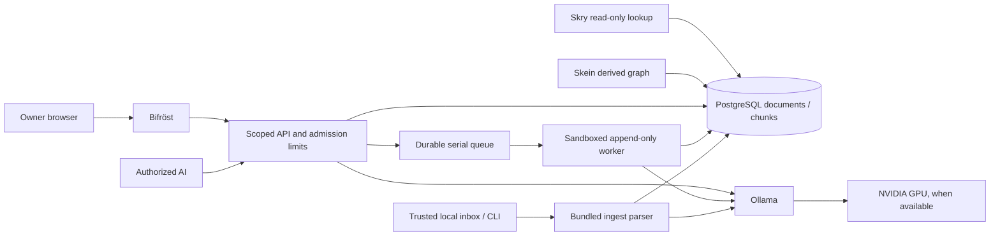

# Second brain: user and operations manual

Documented against the installed stack on 2026-10-01. Commands use the current
Linux directory layout; replace paths and hosts when installing elsewhere. No
credential, mailbox password or private knowledge is included in this manual.

## Contents

1. [What each part does](#what-each-part-does)
2. [Open and use the brain](#open-and-use-the-brain)
3. [Add knowledge](#add-knowledge)
4. [Email recovery and authorized AIs](#email-recovery-and-authorized-ais)
5. [Services and health](#services-and-health)
6. [Ollama and the NVIDIA GPU](#ollama-and-the-nvidia-gpu)
7. [Back up and verify](#back-up-and-verify)
8. [Restore or move to another machine](#restore-or-move-to-another-machine)
9. [Update the projects](#update-the-projects)
10. [Troubleshooting](#troubleshooting)

## What each part does

| Part | Job | Installed location | Detailed guide |
|---|---|---|---|
| Bifröst | Browser viewer, search, graph layouts and supervision | `~/ai/ingest-viewer` | [Viewer manual](TECHNICAL_MANUAL.md) |
| Security gateway | Owner recovery, AI keys, quotas and durable API queue | `~/ai/ingest-viewer/security` | [Security manual](security/TECHNICAL_MANUAL.md) |
| Canonical ingest | Parse files/web pages, chunk, embed and append to PostgreSQL | `~/ai/ingest-viewer/ingest` | [Ingest manual](ingest/TECHNICAL_MANUAL.md) |
| Private ingest state | Inbox, archived inputs, retries, private dotenv and compatibility entry points | `~/ai/ingest` | Local `TECHNICAL_MANUAL.md` in that directory |
| Skein | Build derived entities, relations and evidence links | `~/ai/skein-kg` | [Skein manual](../skein-kg/TECHNICAL_MANUAL.md) |
| Skry | Read-only entity neighborhoods at query time | `~/ai/skry-kg` | [Skry manual](../skry-kg/TECHNICAL_MANUAL.md) |
| eww gauges | Desktop CPU, memory, disk and NVIDIA display | `~/code/eww_viking_gauge_theme` | [Gauge manual](https://github.com/hrabanazviking/eww_viking_gauge_theme/blob/main/TECHNICAL_MANUAL.md) |
| PostgreSQL + pgvector | Durable source documents, chunks, vectors and derived tables | System service | Backup and restore sections below |
| Ollama | Embedding model and optional chat model | System service | GPU section below |
| Tailscale | Private encrypted transport for authorized remote clients | System service | Security manual transport section |



Documents and chunks are the durable knowledge. Bifröst layouts are rebuildable
caches. Skein tables are derived knowledge and can be rebuilt, but a full database
backup preserves them too. An eww gauge is a monitor, not a database or AI service.
The canonical ingest source is now tracked in the Bifröst repository; the private
inbox directory is deliberately separate from Git.

## Open and use the brain

Use the **Bifröst / Second Brain desktop launcher**. From a terminal:

```bash
cd "$HOME/ai/ingest-viewer"
uv run --frozen python scripts/open_brain.py
```

The launcher starts the user service, waits for its listener, reads the current
owner credential from private state and opens the browser. It does not print the
credential. A plain visit to `http://127.0.0.1:8731/` asks for a token instead.
The security page is `http://127.0.0.1:8731/security`.

1. Start in **DOCS**, which gives one node per document and loads more lightly.
2. Switch to **CHUNKS** to inspect individual passages. Hover for a preview and
   click to read the passage and its source in the details panel.
3. Enter a question or phrase in search and press Enter. Normal search combines
   semantic and keyword retrieval. Read the cited chunks before trusting an answer.
4. Enable **HYDE** when a vague question needs a generated hypothetical passage
   to guide retrieval. It uses the configured chat model; generated text is not
   source evidence. A chat failure falls back to the original query.
5. Enable **SKRY** for a ranked neighborhood of names, with evidence chunk IDs.
6. Use **ENTITIES** after a Skein build exists. **BUILD SKEIN** and **NAME CLUSTERS**
   are owner operations and can take time.
7. In CHUNKS, Shift-click two connected chunks to request a semantic path. A path
   shows similarity links, not proof of a historical or causal relationship.

The loader reports build stages. HTTP `202` on a graph means it is still building.
Avoid repeated forced rebuilds while the progress display is advancing. New source
rows trigger cache maintenance. In-place source edits require a forced rebuild
because the fingerprint uses counts and maximum IDs rather than every row's text.

Tokens live in page memory and are removed from the address bar after loading.
Refresh or **Lock** requires launching/signing in again. The old migration token
is read-only for one day after migration; use current owner access or a dedicated
AI key rather than depending on that token.

## Add knowledge

### Files through the private inbox

Place complete files in `~/ai/ingest/inbox`. The watcher checks every five seconds
and waits for a file's modification time to settle. It scans files at the top level
and the `failed` directory; it does not recursively ingest arbitrary subfolders.

For large or actively written files, write a hidden temporary file on the same
filesystem, then rename it to its final name. Hidden filenames are ignored. After
successful ingestion the original is retained in `inbox/processed`; failures stay
in `inbox/failed` with retry metadata. Do not empty these folders to repair a service.

### Files through the trusted CLI

The CLI does not automatically read the viewer's `.env`. Select the private ingest
dotenv explicitly for this installation:

```bash
cd "$HOME/ai/ingest-viewer"
export INGEST_ENV_FILE="$HOME/ai/ingest/.env"
uv run --frozen --project ingest ingest/ingest.py stats
uv run --frozen --project ingest ingest/ingest.py add ./path/to/your-note.md
uv run --frozen --project ingest ingest/ingest.py list --limit 20
uv run --frozen --project ingest ingest/ingest.py search "the well of wisdom" --k 8
```

Replace the example path with an existing file. On a new installation use your
chosen private dotenv, or the configured `ingest/.env`, instead. Keep its embedding
model consistent with the stored vectors. Content-hash matches return success
without inserting a duplicate; a changed document normally becomes a new document.

### URLs and outside AIs

The viewer's **ADD URL** uses the bounded API queue. A successful submission means
accepted into the queue, not yet indexed. Wait for the job to reach `ok` or `failed`.
Public HTTP(S) addresses on ports 80/443 are accepted; private addresses, unsafe
redirects, credentials in URLs and oversized/compressed responses are rejected.

Outside AIs should use scoped API text/URL submission with a stable
`Idempotency-Key`; see the [complete AI protocol](security/TECHNICAL_MANUAL.md).
Do not give an outside AI your database password, owner token or local inbox path.
The local CLI is trusted and has broader database permissions, including an
explicit destructive `delete` command. Remote keys have no delete/update route.

## Email recovery and authorized AIs

Open the owner launcher, then **security & recovery**. Configure **Mail delivery**,
send a verification code to the intended recovery address and confirm the code.
An address is not active for recovery until verified. A replacement address leaves
the current address active until confirmation.

Gmail uses `smtp.gmail.com`, port `587`, **STARTTLS**, your full Gmail address as
username and From address, and an app password entered locally in the masked field.
App passwords require an eligible account with two-step verification; use
[Google's setup instructions](https://support.google.com/mail/answer/185833).
Another verified-TLS SMTP provider can be configured in the same form.

When locked out, open `/security`, request a recovery code and confirm it within
15 minutes. Confirmation returns a replacement owner token and invalidates the
previous owner token. A request by itself does not revoke existing access.
If no working verified email exists, the desktop launcher still recovers access
from intact private local state; restore that state from backup if it was lost.

Under **Authorized AIs**, create one named key per client. Choose read-only or
read-and-append, expiry and quotas; copy the secret once to that client's secret
store. Use the key list to revoke access. A revoked/expired client's queued jobs
do not launch; a currently running atomic append may finish. Details and all
limits are in the [security manual](security/TECHNICAL_MANUAL.md).

## Services and health

```bash
systemctl --user status bifrost.service ingest-watcher.service --no-pager
systemctl status postgresql.service ollama.service --no-pager
systemctl --user is-enabled bifrost.service ingest-watcher.service
journalctl --user -u bifrost.service -u ingest-watcher.service -n 100 --no-pager
sudo journalctl -u ollama.service -n 80 --no-pager
```

The first two are **user** services; PostgreSQL and Ollama are **system** services.
Do not accidentally run the viewer as root. A listener can be alive while its
database or models are unavailable; authenticated `/api/health` reports them
separately. `ok` reflects database availability, not every feature's readiness.

Routine viewer/watcher restart:

```bash
systemctl --user restart bifrost.service ingest-watcher.service
```

Only when changing a unit or drop-in, run `systemctl --user daemon-reload` before
restart. The supplied units restart on failure. Bifröst's unit has a memory ceiling
and child-process cleanup; graph watchdogs and the API queue have separate limits.
Starting at login differs from running after logout: `loginctl show-user "$USER"
-p Linger` reports whether user-service lingering is enabled. Configure lingering
deliberately if this laptop should serve requests while logged out.

Logs and private job payloads can contain your knowledge. Inspect locally and
redact before sharing. Never attach `.env`, `access.sqlite3` or worker configuration
to a public issue. This manual does not add a scheduled backup or monitor.

## Ollama and the NVIDIA GPU

At documentation time this installation reported an RTX 2060 Max-Q with 6 GiB VRAM
and loaded NVIDIA driver/module `595.91.07`. Recheck after kernel or driver updates:

```bash
nvidia-smi
cat /sys/module/nvidia/version
uname -r
lsmod | rg '^nvidia'
```

Use the configured Ollama server. On this installation it is reached as
`http://gungnir:11434`; a fresh installation may use `http://127.0.0.1:11434`.

```bash
export OLLAMA_HOST=http://gungnir:11434
ollama list
ollama ps
```

An idle server can show no loaded models. Inspect `ollama ps` during a real search
or ingest to see actual processor placement, and `nvidia-smi` for GPU activity.
The configured embedding model is `nomic-embed-text`; the chat model is
`llama3.2:3b`. If a required model is absent, deliberately install it with
`ollama pull MODEL_NAME` on the intended server. Do not switch embedding models
for an existing corpus merely because two models have the same vector length:
their vector spaces can still be incompatible.

If `nvidia-smi` fails, distinguish absent module, version mismatch, permissions and
GPU detection before changing packages. Use the distribution's supported driver
workflow, then reboot when an updated module needs loading. Do not mix arbitrary
NVIDIA installer packages with the distribution-managed driver. See
[Ubuntu driver instructions](https://documentation.ubuntu.com/server/how-to/graphics/install-nvidia-drivers/)
and [Ollama hardware guidance](https://docs.ollama.com/gpu).
CPU fallback keeps supported model operations possible but can be much slower.

## Back up and verify

GitHub preserves **source**, not your knowledge, inbox, tokens, SMTP password or
database accounts. A useful recovery backup needs all of these separately:

| Item | Why preserve it |
|---|---|
| PostgreSQL custom-format dump | Source documents/chunks, embeddings, sequences and derived Skein tables |
| Entire Bifröst private state | Owner access, verified email/mail configuration, AI key metadata, queue and idempotency state |
| Viewer, ingest, Skein and Skry private dotenv files | Matching connection/model configuration |
| Entire private inbox, including hidden state | Original retained inputs, failures, completed-URL and retry bookkeeping |
| User units/drop-ins and desktop configuration | Custom paths, startup and gauge layout |
| Repository versions and model names | Reproduce the code and compatible vector space |

Stop both user services and pause all other writers before a coordinated snapshot.
PostgreSQL can remain running. `pg_dump` makes a consistent database snapshot, but
alone does not coordinate files or preserve cluster roles/passwords.
Use a client compatible with the server and follow the
[PostgreSQL backup documentation](https://www.postgresql.org/docs/current/app-pgdump.html).

Example for the current standard paths, run by the local database owner. If using
custom state paths or a remote database, adapt them **before** running it:

```bash
umask 077
BRAIN_BACKUP="$HOME/Documents/SecondBrainBackups/$(date +%Y%m%d-%H%M%S)"
install -d -m 700 "$BRAIN_BACKUP" "$BRAIN_BACKUP/private" "$BRAIN_BACKUP/units"
systemctl --user stop ingest-watcher.service bifrost.service
pg_dump --format=custom --file="$BRAIN_BACKUP/knowledge.dump" knowledge
cp -a "$HOME/.local/state/bifrost" "$BRAIN_BACKUP/private/bifrost"
cp -a "$HOME/ai/ingest/inbox" "$BRAIN_BACKUP/private/inbox"
cp -a "$HOME/ai/ingest-viewer/.env" "$BRAIN_BACKUP/private/viewer.env"
cp -a "$HOME/ai/ingest/.env" "$BRAIN_BACKUP/private/ingest.env"
cp -a "$HOME/ai/skein-kg/.env" "$BRAIN_BACKUP/private/skein.env"
cp -a "$HOME/ai/skry-kg/.env" "$BRAIN_BACKUP/private/skry.env"
cp -a "$HOME/.config/systemd/user/bifrost.service" "$BRAIN_BACKUP/units/"
cp -a "$HOME/.config/systemd/user/ingest-watcher.service" "$BRAIN_BACKUP/units/"
pg_restore --list "$BRAIN_BACKUP/knowledge.dump" > "$BRAIN_BACKUP/archive-list.txt"
sha256sum "$BRAIN_BACKUP/knowledge.dump" > "$BRAIN_BACKUP/knowledge.sha256"
systemctl --user start bifrost.service ingest-watcher.service
```

Run step by step and inspect failures; do not treat a failed copy or dump as a
complete backup. Copy relevant `.service.d` directories, eww configuration and
other private settings if present. Record each repository's `git rev-parse HEAD`.
The state path above is the current default; `VIEWER_SECURITY_DIR` and
`XDG_STATE_HOME` can relocate it. Preserve all files within that directory, not
only SQLite. The checkpoint can resume interrupted API jobs through deduplication.

This example creates a local private snapshot, **not an encrypted off-machine
backup**. Encrypt it with an owner-controlled tool before uploading or transporting
it, and keep the decryption key separately. A second copy on independent storage
protects against loss of this laptop. Database dumps and role backups are sensitive.

An archive listing verifies readability, not complete restore correctness. Test
a restore into a new scratch database whose name is unused:

```bash
createdb --template=template0 knowledge_restore_test
pg_restore --exit-on-error --no-owner --no-privileges \
  --dbname=knowledge_restore_test "$BRAIN_BACKUP/knowledge.dump"
psql -d knowledge_restore_test -c \
  'SELECT (SELECT count(*) FROM documents) AS documents, (SELECT count(*) FROM chunks) AS chunks;'
```

Install required PostgreSQL extensions first. This does not overwrite `knowledge`.
Compare counts, sample text and vector dimensions with the recorded snapshot.
No cleanup/drop command is included; retain or deliberately remove the scratch
database according to your maintenance decision.

## Restore or move to another machine

1. Restore to an **empty, deliberately selected database**. Install PostgreSQL,
   pgvector/pg_trgm, Python 3.13+, uv, Ollama and Linux Bubblewrap/user namespaces.
   The hardened HTTP worker is Linux-specific; browser clients can use other OSes.
2. Clone Bifröst as `~/ai/ingest-viewer`, with `skein-kg` and `skry-kg` alongside it.
   Preserve this sibling layout: Bifröst's dependency configuration uses these paths.
   Restore the tested source revision before considering an upgrade.
3. Restore the dump with `pg_restore --exit-on-error --no-owner --no-privileges`
   to that empty target. This makes the restoring account own restored objects;
   establish database roles and privileges deliberately. Do not use `--clean` on
   a live corpus. Consult [pg_restore](https://www.postgresql.org/docs/current/app-pgrestore.html).
4. With services stopped, restore the entire private Bifröst state and inbox.
   Restrict state directories to the owner (`0700`) and credential files to `0600`.
   Correct ownership for the new Unix user. Existing tokens/queued work survive
   only when their state is preserved; this is a secret-bearing transfer.
5. Restore private dotenv files and edit DB URLs, Ollama hosts, bind address,
   allowed hosts/origins and any TLS paths. Set `VIEWER_SECURITY_DIR`,
   `INGEST_ENV_FILE` and `INGEST_STATE_DIR` if the restored layout differs.
6. Run `uv sync --frozen` in Bifröst, Skry and Skein and
   `uv sync --frozen --project ingest` in Bifröst. Install the same embedding model.
7. If the DB or credentials changed, run `scripts/setup_append_role.py` from
   Bifröst while its service is stopped. It rotates the restricted worker password;
   restore/grant its role on the new DB rather than giving the worker owner rights.
8. Install/edit user service templates, including watcher environment paths,
   then `systemctl --user daemon-reload` and enable/start the services.
9. Open via the owner launcher; check health, a known chunk, search, graph status,
   and a small deliberate append with a test AI key. Confirm mail delivery and the
   verified recovery address again. Rebuild disposable layouts when necessary.
10. Reconnect authorized remote clients to the new endpoint. Prefer issuing fresh
    keys and revoking old ones after a planned move. Retire the old server only
    after the new installation and backups are verified.

Restoring API state while changing the knowledge database can replay previously
queued work into the new database. Review that queue before enabling writers.
Database/Ollama access control remains separate from Bifröst's API permissions.

## Update the projects

Back up first and finish/pause writers. Inspect each working tree before pulling:

```bash
git -C "$HOME/ai/ingest-viewer" status --short
git -C "$HOME/ai/skein-kg" status --short
git -C "$HOME/ai/skry-kg" status --short
git -C "$HOME/code/eww_viking_gauge_theme" status --short
```

Preserve local edits. Use `git pull --ff-only` in each repository; a refusal needs
review of divergent history, not a hard reset. Stop user services before updating
their source, synchronize frozen environments, then run the published checks:

```bash
cd "$HOME/ai/ingest-viewer"
uv sync --frozen
uv sync --frozen --project ingest
uv run --frozen pytest -q
uv run --frozen --project ingest python -m unittest discover -s ingest/tests -v
cd "$HOME/ai/skry-kg"
uv sync --frozen
uv run --frozen pytest -q
cd "$HOME/ai/skein-kg"
uv sync --frozen
uv run --frozen pytest -q
cd "$HOME/code/eww_viking_gauge_theme"
python3 -m unittest discover -s tests -v
```

Copy/reload eww files only when updating the installed desktop configuration;
editing the checkout alone does not update an independent installed copy. Reinstall
a changed service template only after preserving local path/drop-in modifications.
Restart the user services after checks pass and inspect health and logs.

Code rollback is selecting a previously tested source revision plus its lockfiles
and restoring its runtime, with services stopped. Data/security-state rollback is
a separate restore operation and may reactivate credentials or replay queued work.
Do not indiscriminately roll state backward to fix a code problem.

## Troubleshooting

| Symptom | First check | Next action |
|---|---|---|
| Browser cannot connect | User-service status and journal; configured port/listeners | Start/restart service after identifying bind/config error |
| Old token cannot unlock settings | Launcher versus migration key | Open with current owner launcher; issue per-client keys |
| Email request accepted but nothing arrives | Verified address, SMTP password, spam and local journal | Correct mail settings; request a fresh code within request limits |
| `KeyError: INGEST_DB_URL` even for CLI help | `INGEST_ENV_FILE` points to configured private dotenv | Export it explicitly; do not copy credentials into source |
| Health reports DB false | PostgreSQL, URL/authentication and Tailscale DNS if remote | Restore connectivity; maintenance retries afterward |
| Search says keyword/degraded | Ollama URL, loaded model, driver and logs | Restore embedding service; existing keyword search remains available |
| Graph returns 202 | Build progress and last-update time | Wait while advancing; investigate stalls and retry cooldown |
| API submission returns 429 | `Retry-After`, per-key and global budgets | Back off; reuse the original idempotency key |
| API job fails with sandbox policy | `bwrap`, user namespaces, frozen parser runtime | Restore sandbox support; no unsafe fallback is provided |
| URL rejected although it opens in a browser | Private DNS, redirect, port, compression or response size | Use a supported public page, or trusted owner file ingestion |
| Skein entity view missing | `skein stats`, build log and embedding compatibility | Build Skein after source ingestion has settled |
| eww shows zeros/unavailable | Collector JSON, sensors and `nvidia-smi` | Repair collection/config; it does not mean knowledge was lost |

Preserve evidence and inputs while diagnosing. Automatic recovery covers transient
outages, interrupted jobs, missing/stale caches and retryable work. It cannot repair
wrong credentials, a lost private state directory, incompatible embedding spaces,
mail-account policy, exhausted disk or an unsupported sandbox by itself.

## Related technical records

- [Viewer manual](TECHNICAL_MANUAL.md)
- [Security and outside-AI manual](security/TECHNICAL_MANUAL.md)
- [Trusted ingest manual](ingest/TECHNICAL_MANUAL.md)
- [HTTP contracts](INTERFACE.md) and [security contracts](security/INTERFACE.md)
- [Architecture](ARCHITECTURE.md), [domain ownership](DOMAIN_MAP.md),
  [data flow](DATA_FLOW.md), [development log](DEVLOG.md)

## 14. Ingestion and build recovery added 2026-10-01

The Security page now has an **Ingestion recovery** panel. Refresh to inspect
API jobs, progress, error categories and inbox cooldown. After correcting a failed
job's cause, the owner can retry its original payload up to three times; revoked
clients remain blocked. See the [ingest recovery instructions](ingest/TECHNICAL_MANUAL.md#10-read-only-diagnosis-and-recovery-decisions)
and [owner recovery details](security/TECHNICAL_MANUAL.md#11-owner-ingestion-recovery).
The source doctor checks counts/vector/chunk integrity without changing data.

Skein 0.1.1 serializes builds with a database advisory lock. A malformed vocabulary
response counts as failed discovery; by default more than 10% failed documents
aborts publication and keeps the previous graph. The threshold is configurable.
A valid empty vocabulary for a document is allowed. Bifröst's entity cache tracks
the actual build generation, so another build of the same corpus receives its own
layout. Read the [Skein manual](../skein-kg/TECHNICAL_MANUAL.md) before changing
coverage thresholds or forcing a build.

## Friendly workspace and AI connection center (2026-10-01)

The default home is now a responsive human workspace with searchable passage
excerpts, a reader, note/page append forms, service status and import progress.
The existing 3D viewer is under **Explore graph** (`/explore`). The desktop launcher
opens the new workspace using its private owner token as before.

**Connect an AI** (`/connect`) provides a three-step setup, the advertised server
address, REST/MCP templates, a credential-free MD handoff download and a read-only
AI-key check. **Settings** groups recovery, key issuance, advanced quotas, the
portable advertised address and retained import recovery. A new key is shown once
and has a copy button. Saving an advertised address changes metadata; listeners,
allowed Hosts, DNS and TLS still need appropriate deployment configuration.

Read [AI_CONNECT.md](AI_CONNECT.md) for complete network, authentication,
REST, idempotency, polling and MCP instructions; see the
[portable client guide](clients/README_AI.md) for Python integration.
All agent tools use the same scoped REST gateway. Append MCP tools require an
explicit client opt-in and an ingest-scoped key. No additional public MCP listener
or database access is introduced. Browser activity polling pauses when hidden and
honors server retry delays. Lost submissions keep their original operation ID
while the page stays open; check activity before reloading. Secrets and drafts
are never persisted in browser storage.
